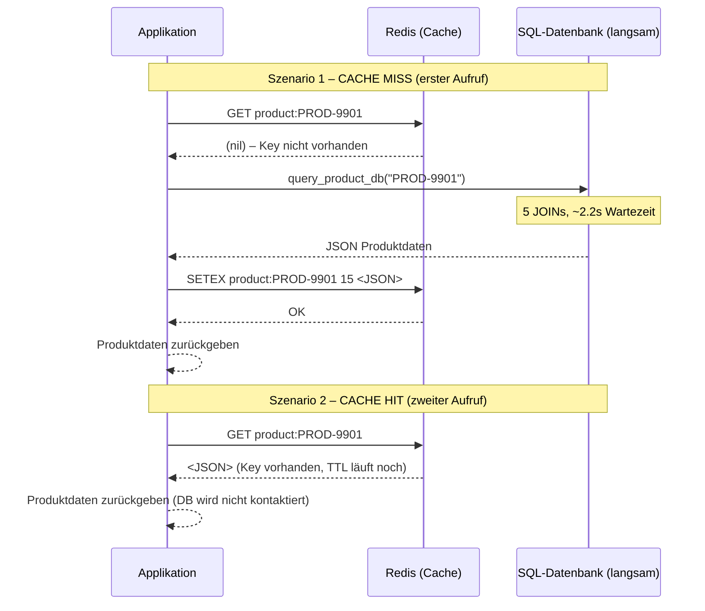

# KN03 – Redis In-Memory und Caching-Strategien
## Gruppe C: E-Commerce Produkt-Katalog

---

## Phase 1: Infrastruktur, Cloud-Init & Den Flaschenhals verstehen (30%)

### Security Group – Inbound Rules
> **Abgabe:** Screenshot der Security Group Inbound Rules aus der AWS Konsole.  
> 


Konfiguration:
| Port | Protokoll | Quelle          | Zweck         |
|------|-----------|-----------------|---------------|
| 22   | TCP       | Meine IP / 0.0.0.0/0 | SSH-Zugang    |

Redis (Port 6379) ist **nicht** nach aussen geöffnet – Kommunikation läuft ausschliesslich intern (localhost).

---

### Redis läuft – `redis-cli ping`
> **Abgabe:** Screenshot der SSH-Konsole mit Ausgabe `PONG`.  
> 


Befehl:
```bash


redis-cli ping
# Erwartete Ausgabe: PONG
```

---

### Warum sind Latenzen von 2–3 Sekunden kritisch?

In modernen Web-Applikationen und APIs erwarten Nutzer Antwortzeiten unter 200–300 ms.
Dauert jede Anfrage 2–3 Sekunden, verschlechtert sich die User Experience drastisch, da Nutzer die Seite als «eingefroren» wahrnehmen und abspringen.
Zusätzlich skaliert das System schlecht: Treffen mehrere gleichzeitige Anfragen ein, verstärken sich die Wartezeiten gegenseitig (Stau-Effekt), was den Server schnell an seine Kapazitätsgrenzen bringt.

---

## Phase 2: Implementierung Caching (40%)

### Was ist das Cache-Aside Pattern?

Beim **Cache-Aside Pattern** (auch «Lazy Loading» genannt) verwaltet die **Applikation selbst** den Cache – nicht die Datenbank. Der Ablauf ist:

1. Applikation prüft zuerst den Cache (Redis) nach dem gewünschten Key.
2. **Cache Hit:** Der Wert ist vorhanden → direkt zurückgeben, keine DB-Abfrage nötig.
3. **Cache Miss:** Der Wert fehlt → langsame Datenquelle abfragen, Ergebnis im Cache speichern, dann zurückgeben.

Der Cache wird also «on demand» befüllt und bleibt schlankt, weil nur tatsächlich abgefragte Daten gespeichert werden.

---

### Implementierter Python-Code

```python
import time
import random
import redis
import json

# KONFIGURATION
try:
    r = redis.Redis(host='localhost', port=6379, decode_responses=True)
    r.ping()
    print("Verbunden mit Redis")
except Exception as e:
    print(f"Konnte nicht mit Redis verbinden: {e}")
    r = None

CACHE_TTL = 15  # Sekunden (für Phase 4)

def query_product_db(product_id):
    """Simuliert eine langsame relationale Datenbank-Abfrage mit vielen JOINs"""
    print(f"... Führe 5 JOINs in der SQL-Datenbank für '{product_id}' aus (bitte warten) ...")
    time.sleep(2.2)  # Künstliche Verzögerung
    product = {
        "id": product_id,
        "name": f"Premium Artikel {product_id}",
        "description": "Ein hervorragendes Produkt für den Alltag.",
        "price": random.choice([19.90, 49.00, 129.50]),
        "stock": random.randint(0, 50)
    }
    return json.dumps(product)


def get_product(product_id):
    """
    Cache-Aside Pattern:
    1. Prüfen ob der Key in Redis existiert (Cache Hit?)
    2. Cache Hit  -> Wert direkt aus Redis zurückgeben
    3. Cache Miss -> Langsame DB-Abfrage, Ergebnis in Redis speichern (mit TTL), zurückgeben
    """
    cache_key = f"product:{product_id}"

    # 1. Cache-Lookup
    if r is not None:
        cached_value = r.get(cache_key)
        if cached_value is not None:
            print(f"[CACHE HIT] Key '{cache_key}' gefunden – Daten aus Redis geladen.")
            return cached_value

    # 2. Cache Miss – Daten aus der "Datenbank" holen
    print(f"[CACHE MISS] Key '{cache_key}' nicht im Cache – Datenbankabfrage wird gestartet.")
    result = query_product_db(product_id)

    # 3. Ergebnis in Redis speichern (mit TTL für automatischen Ablauf)
    if r is not None:
        r.setex(cache_key, CACHE_TTL, result)
        print(f"[CACHE SET] Ergebnis unter '{cache_key}' für {CACHE_TTL}s gespeichert.")

    return result


# TEST-ABLAUF
test_id = "PROD-9901"

print("\n--- Erster Aufruf (Cache Miss - sollte langsam sein) ---")
start = time.time()
print(f"Produktdaten: {get_product(test_id)}")
print(f"Dauer: {time.time() - start:.4f} Sekunden")

print("\n--- Zweiter Aufruf (Cache Hit - sollte blitzschnell sein) ---")
start = time.time()
print(f"Produktdaten: {get_product(test_id)}")
print(f"Dauer: {time.time() - start:.4f} Sekunden")
```

---

### Konzept-Diagramm: Cache Miss & Cache Hit



---

## Phase 3: Performance-Vergleich (10%)

### Messergebnisse

> **Abgabe:** Screenshot der Terminal-Ausgabe mit Zeitmessungen.  
>


| Aufruf | Typ        | Dauer       |
|--------|------------|-------------|
| 1.     | Cache Miss | ~2.20 s     |
| 2.     | Cache Hit  | ~0.0005 s   |

**Beschleunigungsfaktor:** ~4400×

Der erste Aufruf durchläuft die simulierten 5 SQL-JOINs inklusive der künstlichen 2.2s-Verzögerung.  
Der zweite Aufruf liest den Wert direkt aus dem In-Memory-Store Redis – die Datenbank wird komplett umgangen.

---

### Redis-CLI Abfrage

> **Abgabe:** Screenshot der Redis-CLI mit `KEYS *` und `GET product:PROD-9901`.  
> 


```bash
redis-cli
127.0.0.1:6379> KEYS *
1) "product:PROD-9901"

127.0.0.1:6379> GET product:PROD-9901
"{\"id\": \"PROD-9901\", \"name\": \"Premium Artikel PROD-9901\", \"description\": \"Ein hervorragendes Produkt fuer den Alltag.\", \"price\": 49.0, \"stock\": 23}"
```

---

## Phase 4: Cache Invalidation & Strategie (20%)

### Schriftliche Ausarbeitung

#### Was ist Cache Invalidation?

Cache Invalidation bezeichnet das gezielte oder automatische Entfernen bzw. Erneuern von Einträgen im Cache, wenn die zugrundeliegenden Daten in der Originalquelle geändert wurden. Ohne Invalidierung liefert der Cache veraltete Daten (**Stale Data**).

#### TTL (Time-To-Live)

Im Script wird `setex(cache_key, 15, result)` verwendet. Redis löscht den Key automatisch nach 15 Sekunden. Danach erzwingt der nächste Aufruf automatisch einen Cache Miss und holt frische Daten aus der Datenbank.

#### Was passiert bei einer Datenänderung?

Wenn sich ein Produktpreis oder der Lagerbestand in der SQL-Datenbank ändert, liefert der Cache während der verbleibenden TTL-Zeit noch den **alten Wert**. Der Nutzer sieht z.B. einen falschen Preis oder einen veralteten Lagerstand. Erst nach Ablauf der TTL werden die neuen Daten aus der DB geladen und im Cache aktualisiert.

#### Kurze vs. lange TTL – Vor- und Nachteile

| TTL        | Vorteile                                              | Nachteile                                              |
|------------|-------------------------------------------------------|--------------------------------------------------------|
| **Kurz** (z.B. 5s)  | Daten sind fast immer aktuell; wenig Stale-Data-Risiko | Mehr Cache Misses → häufigere DB-Abfragen → weniger Leistungsgewinn |
| **Lang** (z.B. 1h)  | Maximale Performance, DB wird stark entlastet          | Lange Zeitspanne mit veralteten Daten; kritisch bei Preis- oder Bestandsänderungen |

**Faustregel:** TTL an die Änderungsfrequenz der Daten anpassen. Produktbeschreibungen ändern sich selten → längere TTL. Lagerbestand oder Preis ändern sich häufig → kürzere TTL oder manuelle Invalidierung bei Änderungen.

---

### TTL Live-Beobachtung

> **Abgabe:** Screenshot mit `TTL product:PROD-9901` (Restzeit sichtbar).  
> 


```bash
127.0.0.1:6379> TTL product:PROD-9901
(integer) 11
127.0.0.1:6379> TTL product:PROD-9901
(integer) 8
127.0.0.1:6379> TTL product:PROD-9901
(integer) 4
```

---

### Key nach TTL-Ablauf

> **Abgabe:** Screenshot mit `GET product:PROD-9901` nach Ablauf → `(nil)`.  
>


```bash
127.0.0.1:6379> GET product:PROD-9901
(nil)
```

Nach Ablauf der 15 Sekunden hat Redis den Key automatisch gelöscht. Der nächste Programmaufruf erzeugt wieder einen Cache Miss und holt frische Daten.

---

## Dateiübersicht

```
KN03/
├── README.md                        ← Diese Datei (alle Ausarbeitungen)
├── script.py                        ← Fertiges Python-Script mit Cache-Aside + TTL
├── phase1/
│   ├── security_group_inbound.png   ← AWS Security Group Screenshot
│   └── redis_ping.png               ← SSH Terminal mit "PONG"
├── phase3/
│   ├── terminal_zeitmessung.png     ← Python-Ausgabe mit Zeitmessungen
│   └── redis_cli_keys.png           ← Redis-CLI mit KEYS * und GET
└── phase4/
    ├── redis_ttl_active.png         ← TTL Countdown in CLI
    └── redis_get_nil.png            ← GET nach Ablauf → (nil)
```
