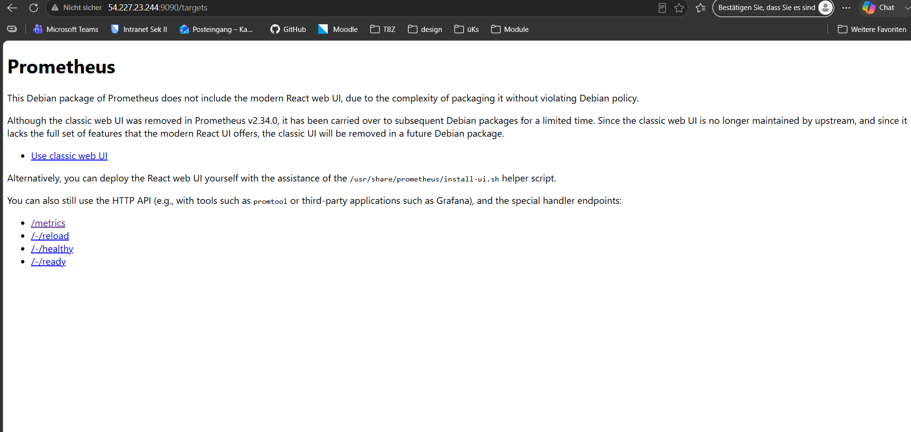
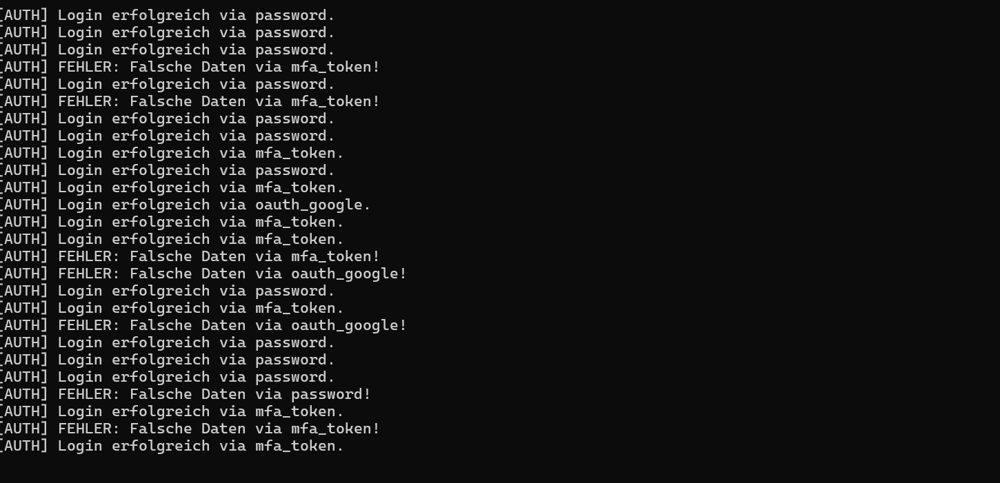
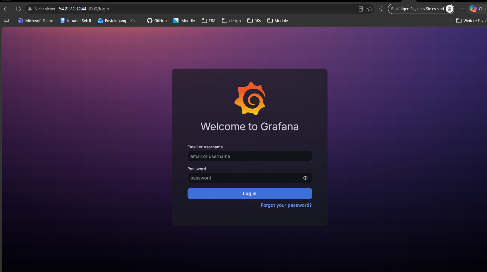
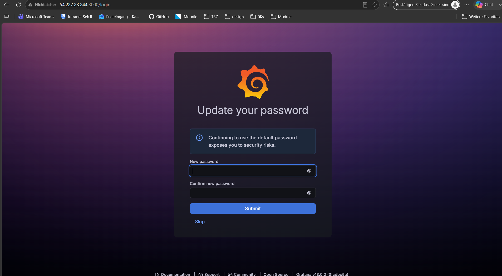
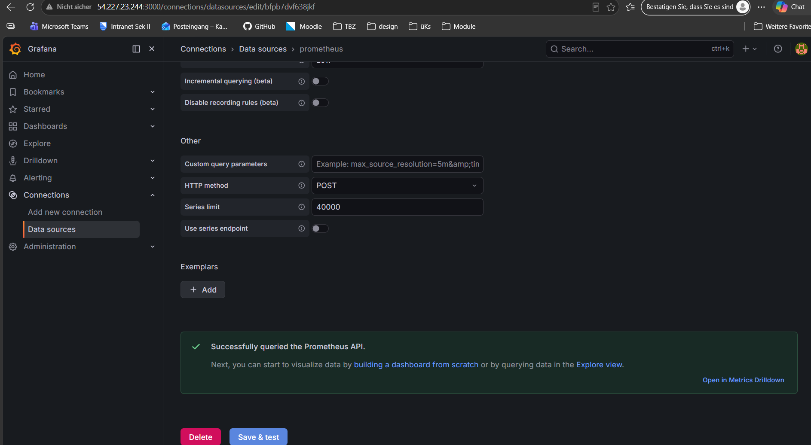
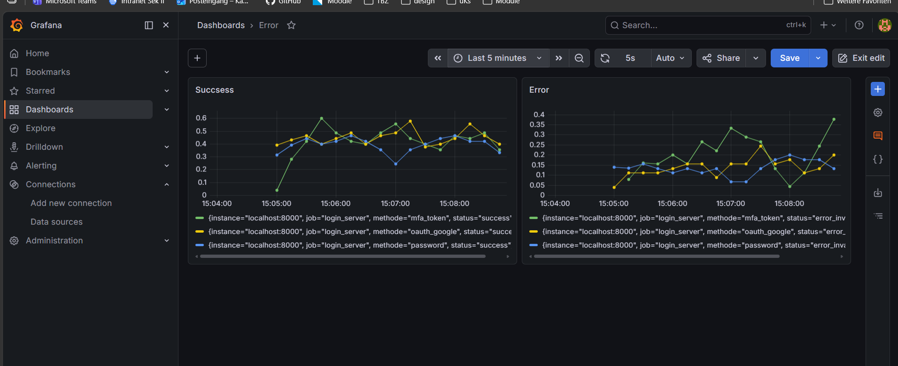

# KN04 – Full-Stack Monitoring mit Prometheus & Grafana

**Szenario C: Login & Auth Server**  
**Datum:** 16.06.2026

---

## Phase 1: Infrastruktur & Das "Blindflug"-Problem (30%)

### Security Group – Inbound Rules


*Security Group der KN04-Instanz (i-0a8d7b88a10703881) mit den konfigurierten Inbound-Regeln.*

Die Security Group wurde so konfiguriert, dass folgende Ports erreichbar sind:

| Port | Protokoll | Quelle    | Zweck            |
|------|-----------|-----------|------------------|
| 22   | TCP       | 0.0.0.0/0 | SSH              |
| 9090 | TCP       | 0.0.0.0/0 | Prometheus       |
| 3000 | TCP       | 0.0.0.0/0 | Grafana          |
| 8000 | TCP       | 0.0.0.0/0 | Python Metriken  |

---

### Prometheus Startseite



*Prometheus läuft erreichbar unter `http://54.87.222.94:9090`*

---

### Terminal Log-Ausgaben (Blindflug-Problem)



*Das Script gibt Logs im Terminal aus – erfolgreiche Logins und Fehler werden direkt geloggt.*

---

### Fragen Phase 1

**Was ist das Hauptmerkmal einer Time-Series Database (TSDB) im Vergleich zu einer klassischen relationalen Datenbank?**

Eine TSDB speichert jeden Datenpunkt zusammen mit einem Zeitstempel und ist für das extrem schnelle sequenzielle Schreiben und zeitbasierte Abfragen optimiert. Eine klassische relationale Datenbank hingegen ist für flexible Abfragen über beliebige Dimensionen konzipiert, nicht speziell für zeitlich geordnete Datenreihen. Bei einer TSDB dreht sich alles um den zeitlichen Verlauf eines Wertes – z. B. „Wie viele Logins pro Sekunde gab es in den letzten 5 Minuten?"

**Warum ist es in einer modernen Cloud-Umgebung mit hunderten Servern eine schlechte Idee, sich auf Terminal-Logs zu verlassen?**

In einer modernen Cloud-Umgebung mit hunderten von Servern müsste man sich manuell auf jeden einzelnen Server per SSH verbinden, um dessen Logs zu lesen – das ist bei einem Fehler um 3 Uhr nachts schlicht nicht praktikabel. Terminal-Logs sind zudem flüchtig (verschwinden bei Neustart), nicht durchsuchbar über alle Server hinweg, und geben keinen Überblick über Trends oder Muster im Gesamtsystem. Ausserdem gibt es keine Möglichkeit, automatisch Muster oder Anomalien über alle Server hinweg zu erkennen oder Alarme auszulösen. Ein zentrales Monitoring-System wie Prometheus sammelt die Daten automatisch und erlaubt es, Anomalien in Echtzeit über alle Instanzen hinweg zu erkennen.

---

## Phase 2: Die Instrumentierung (Code) (30%)

### Angepasster Python-Code

```python
import time
import random
from prometheus_client import start_http_server, Counter  # AUFGABE 1

# AUFGABE 2: Metrik erstellen
auth_metric = Counter('auth_attempts_total', 'Anzahl der Logins', ['methode', 'status'])

def process_login():
    methods = ['password', 'oauth_google', 'mfa_token']
    method = random.choice(methods)
    
    # 70% Erfolgsquote
    if random.random() > 0.3:
        status = 'success'
        print(f"[AUTH] Login erfolgreich via {method}.")
    else:
        status = 'error_invalid_credentials'
        print(f"[AUTH] FEHLER: Falsche Daten via {method}!")
    
    # AUFGABE 3: Metrik erhöhen
    auth_metric.labels(methode=method, status=status).inc()

if __name__ == '__main__':
    print("Starte Login Server Simulation...")
    start_http_server(8000)  # AUFGABE 4
    
    while True:
        process_login()
        time.sleep(random.uniform(0.1, 1.0))
```

### Erklärung der Änderungen

| Aufgabe   | Was wurde gemacht |
|-----------|-------------------|
| Import    | `from prometheus_client import start_http_server, Counter` |
| Metrik    | `Counter('auth_attempts_total', '...', ['methode', 'status'])` – zwei Labels für Methode und Ergebnis |
| Erhöhen   | `auth_metric.labels(methode=method, status=status).inc()` in `process_login()` |
| Server    | `start_http_server(8000)` vor der Endlosschleife |

### Metriken-Endpoint im Browser


*Die Metriken sind abrufbar unter `http://54.87.222.94:8000/metrics`*

---

## Phase 3: Prometheus Konfiguration & Scraping (20%)

### prometheus.yml – Ergänzter Scrape-Job

Folgendes wurde am Ende der `/etc/prometheus/prometheus.yml` ergänzt:

```yaml
  - job_name: 'login_server'
    static_configs:
      - targets: ['localhost:8000']
```

Danach Dienst neu starten:
```bash
sudo systemctl restart prometheus
sudo systemctl status prometheus
```

### Prometheus Targets – Status UP


*Der Login-Server-Job wird erfolgreich mit Status **UP** gescraped.*

---

## Phase 4: Grafana Visualisierung (10%)

### Grafana Login



*Grafana ist erreichbar unter `http://54.87.222.94:3000`*

### Grafana Passwort-Update



*Initiales Passwort wurde beim ersten Login aktualisiert.*

### Prometheus Data Source – erfolgreich verbunden



*Prometheus wurde als Data Source hinzugefügt (`http://localhost:9090`). Test: "Successfully queried the Prometheus API."*

### Empfohlene PromQL-Queries für die Panels

**Panel 1 – Login-Rate pro Methode (nur Erfolge):**
```promql
rate(auth_attempts_total{status="success"}[1m])
```

**Panel 2 – Fehlerrate pro Methode:**
```promql
rate(auth_attempts_total{status="error_invalid_credentials"}[1m])
```

### Dashboard – Last 5 Minutes



*Dashboard mit zwei Panels: "Success" (erfolgreiche Logins) und "Error" (fehlgeschlagene Logins), aufgeschlüsselt nach Methode (`password`, `oauth_google`, `mfa_token`). Zeitraum: Last 5 minutes.*

### Dashboard – Last 1 Hour


*Dashboard mit erweitertem Zeitraum "Last 1 hour" – die Kurven sind deutlich geglättet.*

### Erklärung: Aggregation bei unterschiedlichen Zeitspannen

Bei einer kurzen Zeitspanne (z.B. 5 Minuten) sieht man jeden einzelnen Datenpunkt detailliert – die Kurve wirkt zackig und zeigt alle kurzfristigen Schwankungen. Bei einer langen Zeitspanne (z.B. 1 Stunde) aggregiert Grafana viele Datenpunkte zu einem einzigen Pixel zusammen (Downsampling/Glättung), wodurch die Linie glatter und weniger detailliert wirkt.

---

## Phase 5: Architektur-Reflexion (10%)

**Warum lautet die Target-URL in Prometheus und die Data-Source-URL in Grafana jeweils `localhost`?**

Prometheus und das Python-Script laufen auf **demselben EC2-Server**. Prometheus scrapt also `localhost:8000`, weil das Script lokal auf demselben Host läuft – keine Netzwerkkommunikation über das Internet nötig. Ebenso greift Grafana auf `localhost:9090` zu, weil Grafana ebenfalls auf dieser Instanz läuft. Nur **der Nutzer** greift von aussen über die Public-IP zu – die Dienste selbst kommunizieren intern über das loopback-Interface.

**Welchen Vorteil bietet das dimensionale Datenmodell mit Labels gegenüber separaten SQL-Tabellen?**

In SQL müsste man für jede neue Kombination (z. B. neue Methode "sso_saml") eine neue Tabelle oder Spalte anlegen und die Abfragen anpassen. Mit Prometheus-Labels fügt man einfach einen neuen Label-Wert hinzu – Prometheus erstellt automatisch eine neue Zeitreihe. Bei der Auswertung kann man mit einer einzigen PromQL-Query über alle Dimensionen aggregieren oder filtern (z. B. `{status="error"}` für alle Fehlermethoden auf einmal), ohne Schema-Änderungen. Mit Labels kann man eine einzige Metrik (`auth_attempts_total`) nach beliebig vielen Dimensionen gleichzeitig filtern und gruppieren, ohne Daten zu duplizieren.

**Woher weiss Prometheus, *wann* ein Ereignis stattgefunden hat?**

Im Python-Code wird **nie** manuell ein Timestamp gesetzt, weil das Pull-Modell diesen Schritt übernimmt: Prometheus kontaktiert aktiv alle 15 Sekunden (standardmässig) den `/metrics`-Endpunkt und notiert beim Abholen der Daten selbst die aktuelle Uhrzeit. Dieser Zeitpunkt des Scrapings wird als Timestamp in der TSDB gespeichert. Die App muss sich darum nicht kümmern – sie stellt nur den aktuellen Zählerstand bereit, Prometheus gibt ihm den zeitlichen Kontext.
