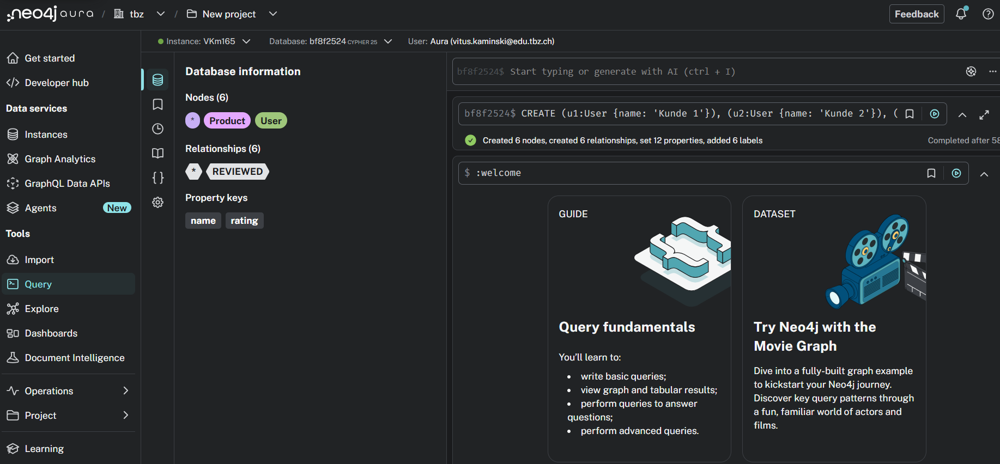
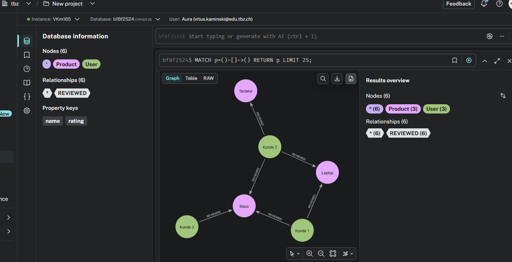
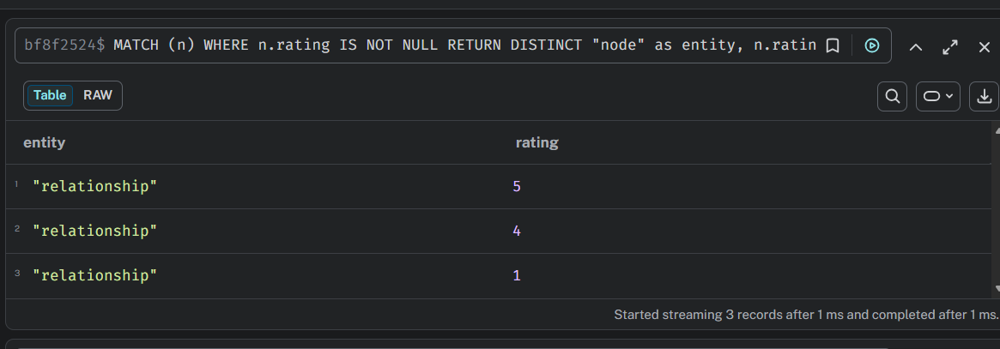
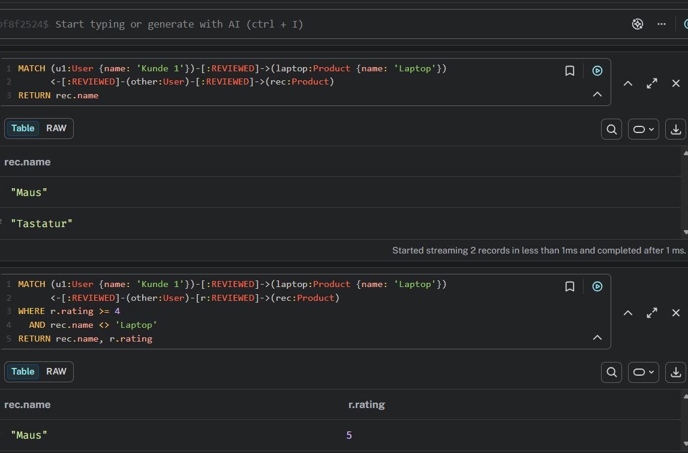

# KN05 – Graphdatenbanken & Neo4j
## Szenario C: Recommendation Engine (E-Commerce)

---

## Phase 1: Cloud Setup & Neo4j Workspace

Verbindung zur Neo4j AuraDB Cloud-Instanz erfolgreich hergestellt.



---

## Phase 2: Kanten-Attribute (Relationship Properties)

### Vollständiger CREATE-Befehl

```cypher
CREATE 
  (u1:User {name: 'Kunde 1'}),
  (u2:User {name: 'Kunde 2'}),
  (u3:User {name: 'Kunde 3'}),
  (p1:Product {name: 'Laptop'}),
  (p2:Product {name: 'Maus'}),
  (p3:Product {name: 'Tastatur'}),

  // Kunde 1: bewertet Laptop und Maus
  (u1)-[:REVIEWED {rating: 5}]->(p1),
  (u1)-[:REVIEWED {rating: 4}]->(p2),

  // Kunde 2: bewertet Laptop, Maus und Tastatur (Tastatur absichtlich schlecht!)
  (u2)-[:REVIEWED {rating: 4}]->(p1),
  (u2)-[:REVIEWED {rating: 5}]->(p2),
  (u2)-[:REVIEWED {rating: 1}]->(p3),

  // Kunde 3: bewertet nur die Maus
  (u3)-[:REVIEWED {rating: 4}]->(p2)
```

### Graph mit sichtbarem Kanten-Attribut (rating)



### Beweis: Rating-Attribute auf den Kanten gespeichert



---

## Phase 3: Der "Broken AI" Ansatz (Debugging)

### Logischer Fehler der ursprünglichen Query

Die ursprüngliche Query filtert nicht das Rating der empfohlenen Produkte. Dadurch wird die Tastatur mit Rating 1 zurückgegeben, obwohl sie schlecht bewertet wurde und nicht empfohlen werden sollte.

### Fehlerhafte Query (original)

```cypher
MATCH (u1:User {name: 'Kunde 1'})-[:REVIEWED]->(laptop:Product {name: 'Laptop'})
      <-[:REVIEWED]-(other:User)-[:REVIEWED]->(rec:Product)
RETURN rec.name
```

### Korrigierte Query

```cypher
MATCH (u1:User {name: 'Kunde 1'})-[:REVIEWED]->(laptop:Product {name: 'Laptop'})
      <-[:REVIEWED]-(other:User)-[r:REVIEWED]->(rec:Product)
WHERE r.rating >= 4
  AND rec.name <> 'Laptop'
RETURN rec.name, r.rating
```

**Änderungen:**
- Die REVIEWED-Kante wird als `[r:REVIEWED]` benannt, damit auf das `rating`-Attribut zugegriffen werden kann.
- `WHERE r.rating >= 4` filtert schlechte Bewertungen (z.B. Tastatur mit Rating 1) heraus.
- `AND rec.name <> 'Laptop'` verhindert, dass der Laptop sich selbst empfiehlt.

### Screenshot: Oben falsche Query (Maus + Tastatur), unten korrekte Query (nur Maus)



---

## Phase 4: Architektur-Reflexion

### SQL-Äquivalent der Kanten-Attribute

Um die `[:REVIEWED {rating}]`-Kanten in einer relationalen Datenbank abzubilden, würde man drei Tabellen benötigen:

| Tabelle | Spalten | Constraints |
|---|---|---|
| `users` | `user_id` (PK), `name` | PK auf `user_id` |
| `products` | `product_id` (PK), `name` | PK auf `product_id` |
| `reviews` | `review_id` (PK), `user_id` (FK), `product_id` (FK), `rating` | FK → `users.user_id`, FK → `products.product_id` |

Die Tabelle `reviews` ist die Mapping-Tabelle, die die m:n-Beziehung zwischen `users` und `products` mit dem zusätzlichen Attribut `rating` abbildet. Jede Beziehung mit einer Eigenschaft erfordert in SQL eine solche dritte Tabelle.

### Index-Free Adjacency vs. Rekursive JOINs

In **SQL** muss bei jeder Abfrage über mehrere Beziehungen ein JOIN ausgeführt werden – also zwei grosse Tabellen anhand von IDs abgeglichen werden. Bei 4 oder mehr Hops werden die JOINs verschachtelt und die verglichene Datenmenge wächst exponentiell, was zu sehr langen Abfragezeiten führt.

In **Neo4j** speichert jeder Knoten direkt einen physischen Zeiger (Pointer) auf seine Nachbarknoten (Index-Free Adjacency). Das bedeutet: Um von Knoten A zu Knoten B zu navigieren, folgt die Datenbank einfach dem Zeiger – ohne eine Tabelle zu durchsuchen. Jeder Hop kostet konstant wenig Zeit, weshalb Neo4j auch bei 6+ Hops in Millisekunden antwortet.
