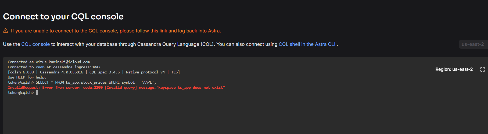
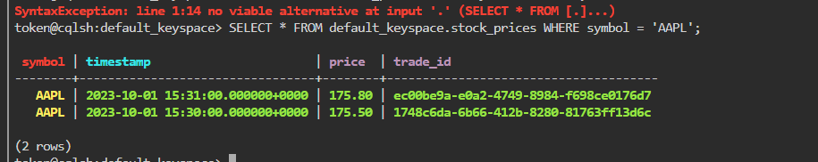

# KN06 – Wide-Column Stores & Query-First Design mit Cassandra
**Szenario D: Finanzdaten (Stock Ticker)**

---

## Phase 1: Cloud Setup & CQL Console

> Astra DB wurde erfolgreich eingerichtet und die CQL Console ist verbunden.

*(Screenshot: Astra DB CQL Console – verbunden)*

---

## Phase 2: Die fehlerhafte KI-Tabelle

### Ausgeführte Befehle

```sql
CREATE TABLE ks_app.stock_prices (
    trade_id  uuid,
    symbol    text,
    timestamp timestamp,
    price     decimal,
    PRIMARY KEY (trade_id)
);

INSERT INTO ks_app.stock_prices (trade_id, symbol, timestamp, price) VALUES (uuid(), 'AAPL', '2023-10-01 15:30:00', 175.50);
INSERT INTO ks_app.stock_prices (trade_id, symbol, timestamp, price) VALUES (uuid(), 'TSLA', '2023-10-01 15:30:05', 250.20);
INSERT INTO ks_app.stock_prices (trade_id, symbol, timestamp, price) VALUES (uuid(), 'AAPL', '2023-10-01 15:31:00', 175.80);
```

### Fehlgeschlagene Abfrage

```sql
SELECT * FROM ks_app.stock_prices WHERE symbol = 'AAPL';
```

### Screenshot – Fehlermeldung



### Erklärung des Fehlers

Cassandra verteilt Daten anhand des **Partition Keys** auf verschiedene Nodes im Cluster. In der fehlerhaften Tabelle ist `trade_id` der Partition Key – das bedeutet, jeder einzelne Trade-Eintrag landet auf einem anderen Node. Wenn nun eine `WHERE`-Klausel auf `symbol` filtert (kein Partition Key), müsste Cassandra **alle Nodes gleichzeitig durchsuchen** (Full Cluster Scan), um die passenden Einträge zu finden. In einem verteilten System mit Hunderten von Nodes wäre dies extrem teuer und unkalkulierbar, weshalb Cassandra die Abfrage mit dem Fehler `Cannot execute this query as it might involve data filtering` verweigert.

---

## Phase 3: Query-First Design (Modellierung reparieren)

### Tabelle gelöscht

```sql
DROP TABLE default_keyspace.stock_prices;
```

### Korrigiertes `CREATE TABLE`

```sql
CREATE TABLE default_keyspace.stock_prices (
    symbol    text,
    timestamp timestamp,
    trade_id  uuid,
    price     decimal,
    PRIMARY KEY (symbol, timestamp)
) WITH CLUSTERING ORDER BY (timestamp DESC);
```

**Begründung:**
- **Partition Key: `symbol`** → Alle Preiseinträge für `AAPL` landen auf demselben Node. Die Abfrage `WHERE symbol = 'AAPL'` trifft direkt den richtigen Node ohne Cluster-Scan.
- **Clustering Column: `timestamp`** → Innerhalb einer Partition werden die Einträge chronologisch sortiert (neueste zuerst), was den Zugriff auf Zeitreihendaten optimiert.

### Daten neu eingefügt

```sql
INSERT INTO default_keyspace.stock_prices (symbol, timestamp, trade_id, price) VALUES ('AAPL', '2023-10-01 15:30:00', uuid(), 175.50);
INSERT INTO default_keyspace.stock_prices (symbol, timestamp, trade_id, price) VALUES ('TSLA', '2023-10-01 15:30:05', uuid(), 250.20);
INSERT INTO default_keyspace.stock_prices (symbol, timestamp, trade_id, price) VALUES ('AAPL', '2023-10-01 15:31:00', uuid(), 175.80);
```

### Erfolgreiche Abfrage

```sql
SELECT * FROM default_keyspace.stock_prices WHERE symbol = 'AAPL';
```

### Screenshot – Korrekte Abfrage



---

## Phase 4: Architektur-Reflexion

### Warum ist `ALLOW FILTERING` ein Anti-Pattern?

`ALLOW FILTERING` zwingt Cassandra, **jeden einzelnen Node** im gesamten Cluster zu durchsuchen, unabhängig davon, auf welchen Nodes die gesuchten Daten tatsächlich liegen. In einer produktiven Umgebung wie Netflix oder Spotify mit Milliarden von Datensätzen auf Hunderten von Nodes bedeutet dies:

- Eine einzige Abfrage erzeugt **massive Last auf dem gesamten Cluster**
- Alle anderen Abfragen werden dadurch verlangsamt
- Bei vielen gleichzeitigen Anfragen kann dies zu **Serverausfällen** führen
- Die Performance verschlechtert sich linear mit der Datenmenge

`ALLOW FILTERING` ignoriert das Kernprinzip von Cassandra (gezielte Partition-Zugriffe) und macht das Datenmodell de facto wertlos. Es ist ein Symptom für ein falsch modelliertes Schema und kein gültiger Workaround.

---

### Unterschied: Partition Key vs. Clustering Column

| | **Partition Key** | **Clustering Column** |
|---|---|---|
| **Zweck** | Bestimmt, auf welchem **Node** im Cluster die Daten gespeichert werden | Bestimmt die **Sortierreihenfolge** der Daten innerhalb einer Partition |
| **Funktion** | Cassandra wendet eine Hash-Funktion auf den Partition Key an und leitet daraus den Ziel-Node ab | Daten innerhalb einer Partition werden physisch nach der Clustering Column sortiert gespeichert |
| **WHERE-Klausel** | **Pflichtfeld** – ohne Partition Key in der WHERE-Klausel ist keine effiziente Abfrage möglich | Optional – kann zur weiteren Eingrenzung genutzt werden, muss aber in der definierten Reihenfolge angegeben werden |
| **Beispiel (Szenario D)** | `symbol` → alle AAPL-Kurse landen auf demselben Node | `timestamp` → Kurse innerhalb von AAPL sind chronologisch sortiert |
| **Analogie** | Wie ein Regalfach in einem Archiv – bestimmt **wo** etwas liegt | Wie die Sortierung der Akten im Regalfach – bestimmt **in welcher Reihenfolge** sie liegen |
